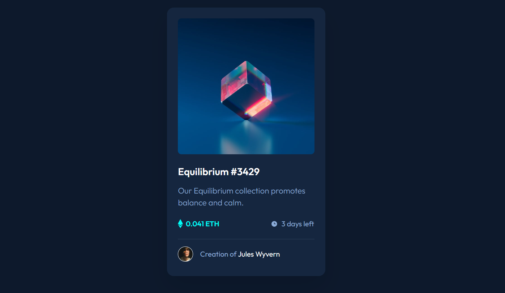

<h1>Frontend Mentor - NFT preview card component solution</h1>

<h3>Screenshot</h3>

<h3>Links</h3>

Solution URL:

<a href="https://tsikvi.github.io/nft-preview-card/"> Live Site URL</a>

<h3>Built with</h3>

Semantic HTML5 markup

CSS custom properties

Flexbox

<h3>What I learned</h3>

How to make cool hover 

<h3>Author</h3>

Elene Gigauri

